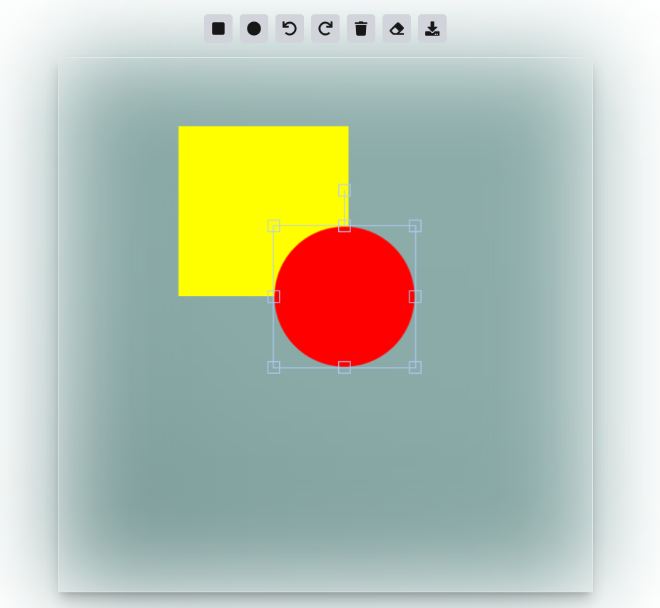

# Design Editor Project

A simple design editor that allows users to select, customize, move, and resize shapes on a canvas. The design editor also supports saving designs in LocalStorage, reloading saved designs, and exporting the canvas as a PNG file.

## Overview:
[]()

## Features

### Minimum Features:
- **Pre-built Shapes**: Select built-in shapes (rectangle, circle).
- **Drag & Resize**: Move and resize shapes on the canvas.
- **Save & Load Designs**: Save user designs to LocalStorage and load them later.
- **Download Design**: Export the design as a PNG file.

### Bonus Features:
- **Undo/Redo**: Basic action history management to undo and redo changes.
- **Transparent Card Effect**: Apply a blurred transparent effect to the background of the canvas.

## Tech Stack

- **Frontend**: Next.js with TypeScript
- **State Management**: `useReducer` or any preferred method
- **Storage**: LocalStorage for saving and loading designs

## Installation

### Prerequisites
Ensure that you have the following tools installed on your system:
- **Git** : Please setup git in your machine
- **Node.js** : (version 14 or higher)
- **npm** or **yarn** : (Node package manager)

### Steps to Install & Run the Project Locally

1. **Clone the repository**:

   ```
   git clone https://github.com/alauddinjahin/fabric-editor.git
   cd fabric-editor
2. **Install & run**:
   ```
   npm install & npm run dev

3. **Open below link with the browser**: 

   ```
   http://localhost:3000

**Note**:
   Here I am just focusing on the features, not on responsiveness and design.
   To view more design Please clone and run the design in your machine:
   ```
    https://github.com/alauddinjahin/fb_clone.git 

